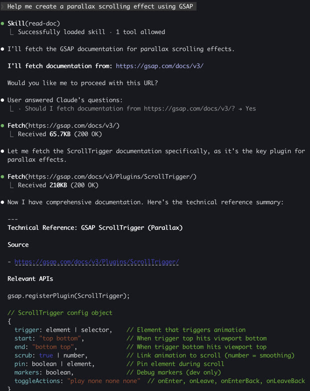

# Read Document Skill

[中文文档](./README_CN.md)

Claude Code skill for documentation-driven code generation. This skill fetches official documentation and creates a technical reference summary as a pre-step for code generation.



## Installation

```bash
npx skills add wxul/read-document-skill
```

### Manual Installation

```bash
git clone https://github.com/wxul/read-document-skill.git
cp -r read-document-skill/skills/* .claude/skills/
```

## How It Works

```
User requests code with a technology
            ↓
    Skill triggered automatically
            ↓
   Suggest documentation URL
            ↓
  ┌─────────┼─────────┐
  Yes    Different   Ignore
  ↓         ↓          ↓
Fetch    Fetch     Skip to
 docs    alt URL   code gen
  ↓         ↓
  └────┬────┘
       ↓
Generate Technical Reference Summary
       ↓
Use summary for code generation
```

## Usage

### Automatic Trigger

The skill triggers automatically when you mention a technology and request code:

```
Help me create a parallax scrolling effect using GSAP
```

Claude will:
1. Suggest GSAP documentation URL
2. Ask you to confirm, provide alternative, or ignore
3. Fetch and summarize relevant documentation
4. Use the summary to generate accurate code

### Manual Invocation

```
/read-doc Help me create a parallax scrolling effect using GSAP
```

## Examples

### Animation Library

```
/read-doc gsap create a scroll-triggered animation
```

```
/read-doc framer-motion add a drag-to-reorder list
```

### State Management

```
/read-doc zustand create a shopping cart store with persist
```

```
/read-doc jotai manage form state with atoms
```

### Data Fetching

```
/read-doc tanstack-query fetch and cache user data with pagination
```

```
/read-doc swr implement infinite scroll loading
```

### UI Framework

```
/read-doc shadcn create a command palette component
```

```
/read-doc radix-ui build an accessible dropdown menu
```

### 3D / Visualization

```
/read-doc three.js create a rotating 3D cube with orbit controls
```

```
/read-doc d3 build an interactive bar chart
```

### Form & Validation

```
/read-doc react-hook-form create a multi-step form wizard
```

```
/read-doc zod define a user registration schema
```

## Options When Prompted

When the skill suggests a documentation URL, you have three options:

| Option | Description |
|--------|-------------|
| **Yes** | Use the suggested URL |
| **Different URL** | Provide your own documentation URL |
| **Ignore** | Skip documentation fetch, use existing knowledge |

## Output

The skill produces a Technical Reference Summary:

```markdown
## Technical Reference: [technology]

### Source
- [documentation URL]

### Relevant APIs
[API signatures, parameters, return types]

### Usage Patterns
[Code examples from docs]

### Best Practices
[Recommendations from docs]

### Notes
[Important caveats or version-specific info]
```

This summary is then used as reference for code generation.

## License

ISC
